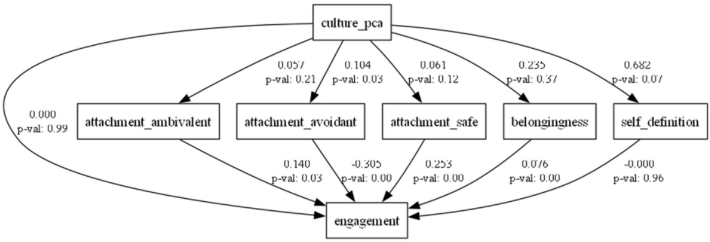

# 📘 Structural Equation Modeling Approach to Interrelation Between Organizational Culture and Employee Behavior

🔗 **View the full interactive analysis on nbviewer:**  
👉 [Open in nbviewer](https://nbviewer.org/github/diana-legrand/pet_projects/blob/main/sem_project/sem_project.ipynb)

---

## 📝 Project Description

This project explores how different types of **perceived organizational culture** affect **employee engagement**, both directly and through **psychological mediators** such as attachment styles and the need for belonging.

We conducted a behavioral study using **Structural Equation Modeling (SEM)** in Python with the `semopy` package. The analysis includes:

- **Confirmatory Factor Analysis (CFA)** to validate measurement constructs  
- **Dimensionality reduction via Principal Component Analysis (PCA)**  
- **Mediation analysis** to evaluate indirect effects of organizational culture  
- **Regression modeling** to assess predictive strength and path coefficients  

The findings show that the **effect of organizational culture on engagement is indirect**, primarily mediated by **secure/avoidant attachment styles** and the **need for belonging**.

## 🔍 Key Methods

- **Survey-based data collection** (N = 142)
- **PCA** applied to four culture-type variables
- **SEM** model structure:  
  - Direct path: `culture_pca → engagement`  
  - Indirect paths through: `attachment_safe`, `attachment_avoidant`, `attachment_ambivalent`, `belongingness`, `self_definition`

## 🔧 Tools and Libraries

- `pandas` – Data manipulation  
- `semopy` – Structural equation modeling  
- `statsmodels` – Regression analysis and diagnostics  
- `scikit-learn` – PCA and preprocessing  

## 📁 Files

- `sem_project.ipynb` – Full analysis in a Jupyter Notebook  
- `README.md` – Project summary and methods overview  

## 📌 Main Conclusion

> Organizational culture influences employee engagement **indirectly** via dispositional characteristics.  
> The strongest mediators are **attachment styles** (especially avoidant and secure) and the **need for belonging**.
>
## 📊 SEM Path Diagram

The diagram below visualizes the structure and results of the final SEM model. It illustrates the direct and indirect effects of perceived organizational culture (`culture_pca`) on employee engagement, mediated by psychological characteristics.

### 🔍 Key Results from the Diagram

- **No direct effect** of organizational culture on engagement  
  - `culture_pca → engagement`: **β = 0.000**, *p* = 0.99

- **Significant indirect effects**:
  - `culture_pca → attachment_avoidant`: **β = 0.104**, *p* = 0.03
  - `attachment_avoidant → engagement`: **β = -0.305**, *p* < 0.001
  - `attachment_safe → engagement`: **β = 0.235**, *p* < 0.001
  - `attachment_ambivalent → engagement`: **β = 0.140**, *p* = 0.03
  - `belongingness → engagement`: **β = 0.076**, *p* < 0.001

- **Non-significant paths**:
  - `culture_pca → attachment_safe`: *p* = 0.12  
  - `culture_pca → attachment_ambivalent`: *p* = 0.21  
  - `culture_pca → belongingness`: *p* = 0.57  
  - `self_definition → engagement`: **β = -0.000**, *p* = 0.96

- **Trend toward significance**:
  - `culture_pca → self_definition`: **β = 0.682**, *p* = 0.07

### ✅ Interpretation

These results confirm that **organizational culture influences engagement indirectly**, primarily through:
- **Attachment styles** (avoidant and secure)
- **The need for belonging**

This supports a **psychologically mediated model** of employee engagement.

